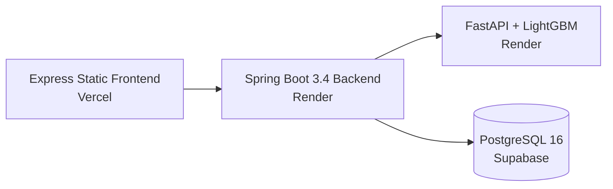

<div align="center">
  <h1>🎓 ApEapcetEngine</h1>
  <p>Data-driven college admission predictor for AP EAPCET, powered by LightGBM machine learning.</p>

  <p>
    <a href="https://github.com/sreemani0323/ApEapcetEngine/blob/main/LICENSE"></a>
    <a href="https://github.com/sreemani0323/ApEapcetEngine/issues"></a>
    <a href="https://github.com/sreemani0323/ApEapcetEngine/pulls"></a>
  </p>

  <p>
    
    
    
    
    
    
  </p>
</div>

---

## 📖 Overview

**ApEapcetEngine** analyzes **44,000+ historical cutoff records** across **200+ engineering institutions** in Andhra Pradesh. It leverages a LightGBM machine learning model to predict admission probabilities for students based on their EAPCET rank, category, and preferred branch.

This project is built to bring transparency and data-driven decision-making to the college counseling process.

### ✨ Key Features

| Feature | Description |
|---------|-------------|
| **ML Probability Search** | Enter rank → get admission probability for every college-branch combination. |
| **Reverse Calculator** | Target a probability % → engine solves backward for the rank needed. |
| **Institution Explorer** | Browse all 200+ colleges with filters (25 districts, 5 types, 20 affiliations). |
| **Analytics Dashboard** | Branch comparison trends, district summaries, and trending programs. |
| **College Detail Pages** | Branch-wise cutoff matrix (2022 vs 2024) with trend analysis. |
| **Interactive Map** | Explore colleges geographically with district-wise filtering. |
| **Branch Comparison** | Compare cutoff trends across branches with visual charts. |

---

## 🏗 Architecture



- **Frontend:** Express.js serving static HTML/JS/CSS, Chart.js for visualizations, deployed on Vercel
- **Backend:** Spring Boot 3.4, Java 21, Virtual Threads, Caffeine Cache, Resilience4j Circuit Breaker
- **ML Service:** Python FastAPI, LightGBM, scikit-learn
- **Database:** PostgreSQL 16 on Supabase (3NF normalized cutoff storage)

---

## 🚀 Local Setup & Development

We welcome contributors! Here is how to run the full stack locally.

### Prerequisites
- [Java 21+](https://adoptium.net/temurin/releases/)
- [Node.js 18+](https://nodejs.org/)
- [Python 3.12+](https://www.python.org/downloads/)
- [Docker & Docker Compose](https://www.docker.com/) (Optional, for local database)

### Quick Start

1. **Clone the repository:**
   ```bash
   git clone https://github.com/sreemani0323/ApEapcetEngine.git
   cd ApEapcetEngine
   ```

2. **Setup Environment Variables:**
   ```bash
   cp infra/.env.example .env
   # Edit .env and provide your database credentials
   ```

3. **Start PostgreSQL Database:**
   ```bash
   docker compose -f infra/docker-compose.yml up db -d
   ```
   *Note: To populate the database with cutoff data, refer to the `data-pipeline/etl` scripts.*

4. **Start the ML Service:**
   ```bash
   cd apps/ml-service
   pip install -r requirements.txt
   uvicorn app:app --host 0.0.0.0 --port 8000 --reload
   ```

5. **Start the Backend API:** *(in a new terminal)*
   ```bash
   cd apps/backend
   ./mvnw spring-boot:run
   ```

6. **Start the Frontend UI:** *(in a new terminal)*
   ```bash
   cd apps/frontend
   npm install
   npm run dev
   ```

You can now view the app at [http://localhost:5173](http://localhost:5173) and the backend Swagger API Docs at [http://localhost:8080/swagger-ui.html](http://localhost:8080/swagger-ui.html).

---

## 🧠 Machine Learning Model

The core of ApEapcetEngine is a **LightGBM Regressor** trained on 44,000+ official APSCHE cutoff records.

### Probability Calculation
After the model predicts the closing cutoff rank, a sigmoid function converts the relative margin into an admission probability:
```
relative_margin = (predicted_cutoff - user_rank) / predicted_cutoff
z = (relative_margin + 0.05) / VOLATILITY
P(admission) = FLOOR + (sigmoid(z) / 100) × (CEILING - FLOOR)
```
Where `VOLATILITY = 0.20`, `FLOOR = 2%`, `CEILING = 95%`.

### Retraining Pipeline
When new data is released (e.g., 2025 Cutoffs):
1. Add the new CSV file to `data-pipeline/raw/`
2. Run the ETL normalization script: `python data-pipeline/etl/normalize.py`
3. Retrain the model: `python data-pipeline/retrain/train_model.py`
4. Copy the new `.pkl` artifacts into `apps/ml-service/`

---

## 🤝 Contributing

We would love your help making this platform better!

Whether it is adding new features, fixing bugs, or improving documentation, please read our [Contributing Guidelines](CONTRIBUTING.md) and [Code of Conduct](CODE_OF_CONDUCT.md) before getting started.

- [Report a Bug](https://github.com/sreemani0323/ApEapcetEngine/issues/new?template=bug_report.yml)
- [Request a Feature](https://github.com/sreemani0323/ApEapcetEngine/issues/new?template=feature_request.yml)

### Security Vulnerabilities
If you discover a security vulnerability, please refer to our [Security Policy](SECURITY.md) for reporting guidelines. **Do not create public issues for security vulnerabilities.**

---

## 📜 License

This project is licensed under the **MIT License** - see the [LICENSE](LICENSE) file for details.

---

<div align="center">
  Developed by <a href="https://github.com/sreemani0323">sreemani0323</a> & Contributors
</div>
